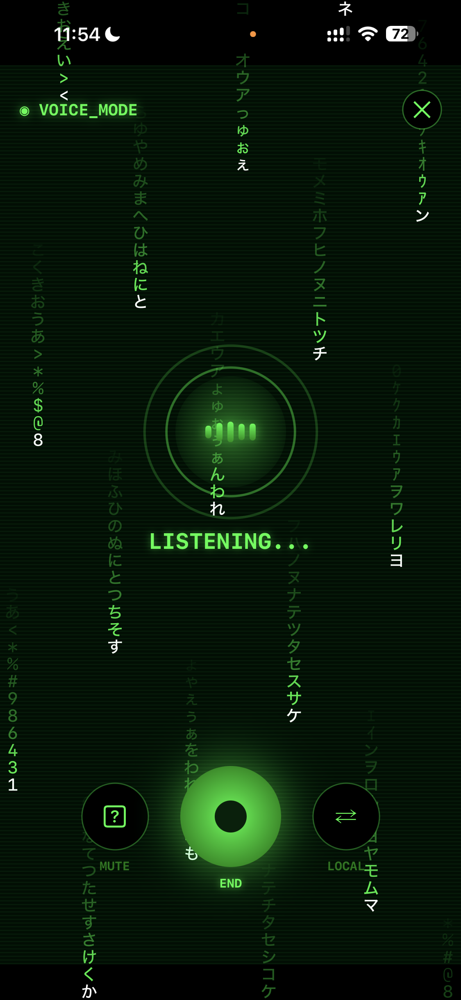
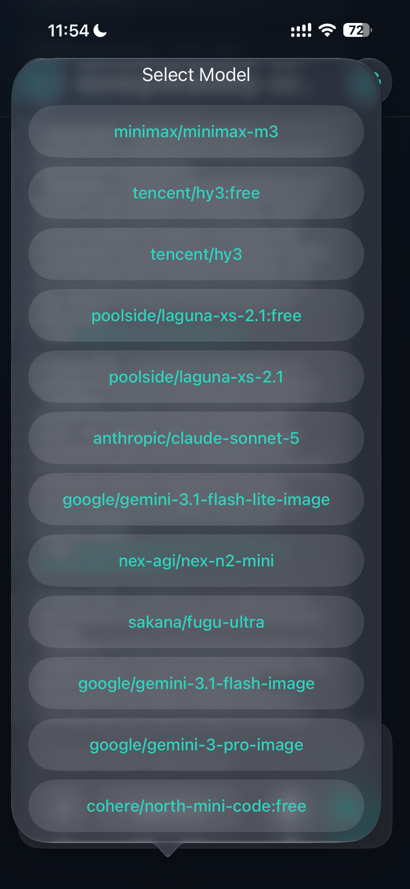
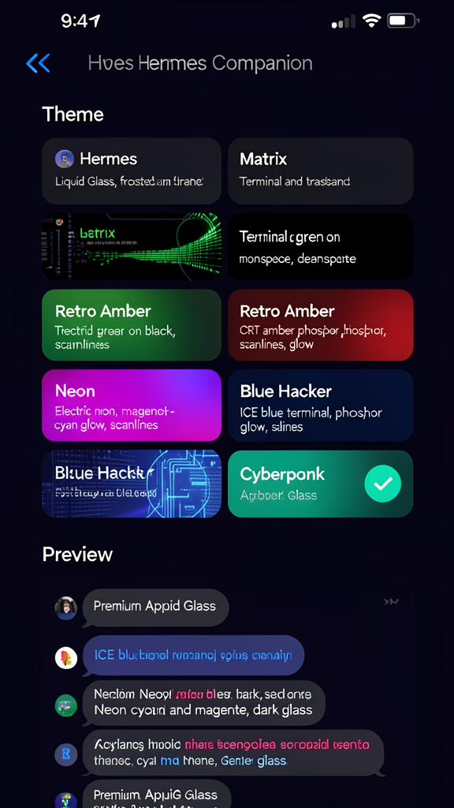

<div align="center">

# Hermes Companion

### The iOS front-end for [Hermes Agent](https://github.com/NousResearch/hermes-agent)

[](https://www.apple.com/ios/)
[](https://chibitek.com)
[](LICENSE)
[](https://github.com/NousResearch/hermes-agent)

**Chat. Voice. Tools. Approvals. Sessions. Themes.**

Your Hermes agent, in your pocket. Stream responses in real time. Talk out loud with Matrix-style voice mode. Approve tool executions. Switch models on the fly. All from your iPhone.

**Self-hosted. Your agent, your machine, your rules.** You run the Hermes Agent gateway on your own hardware — a Mac, a Linux box, a $5 VPS, or serverless infrastructure. Hermes Companion connects to it over an encrypted Tailscale tunnel. No cloud dependency. No middleman. Your data stays on your machines.

Built by [Chibitek Labs](https://chibitek.com) on the [Hermes Agent](https://github.com/NousResearch/hermes-agent) platform by [Nous Research](https://nousresearch.com).

</div>

---

## Hermes Talk

The standout feature. Tap the waveform icon and your phone becomes a full-screen voice conversation terminal.

- **Matrix digital rain** background that responds to conversation state (fast rain while listening, slow glow while thinking, medium while speaking)
- **CRT scanlines and phosphor glow** for that terminal aesthetic
- **Center-orb audio visualizer** with real-time glow pulse
- **Glitch text animations** on the VOICE_MODE indicator
- **4 voice presets**: Matrix (green), Retro Amber, Neon, Blue Hacker
- **On-device transcription** via SFSpeechRecognizer — your speech never leaves the phone until you send it
- **TTS playback** with configurable voice, speed, and pitch
- Screen stays awake during conversations

<p align="center">

</p>

---

## Screenshots

### Chat

Real-time streaming chat with full tool execution visibility. Watch your agent think, call tools, and stream responses. Approve commands before they run. Send photos and files. All in real time.

<p align="center">

</p>

### Sessions

Full conversation history with session types (cron, TUI, API), message counts, and durations. Search, rename, fork, and switch between sessions. Foreground sync pulls in replies from other Hermes surfaces (macOS, Telegram, Discord) automatically.

<p align="center">

</p>

### Settings

Server connection, provider and model selection, skills browser, toolsets, voice configuration, appearance, and version info. All in clean glass-card sections.

<p align="center">

</p>

### Provider and Model Selector

Switch between any provider your Hermes gateway supports — Nous, OpenRouter, Ollama, Huggingface, OpenAI, and more. Models sync automatically from your server. Pick from 300+ models with a single tap.

<p align="center">

</p>

### Themes

Six built-in themes. Each one transforms the entire app — chat bubbles, input bar, settings, and voice page.

| Theme | Style |
| --- | --- |
| **Hermes** | Liquid Glass. Frosted, translucent, default. |
| **Matrix** | Terminal green on black. Monospace. Scanlines. CRT glow. |
| **Retro Amber** | CRT amber phosphor. Scanlines. Glow. |
| **Neon** | Electric magenta + cyan. Scanlines. |
| **Blue Hacker** | ICE blue terminal. Phosphor glow. |
| **Cyberpunk** | Dark glass with neon cyan and magenta accents. |

<p align="center">

</p>

---

## Features

| | |
| --- | --- |
| **Real-time streaming chat** | Full SSE streaming with tool execution visibility, approval prompts, and multimodal support (photos and files). Watch your agent work in real time. |
| **Hermes Talk voice mode** | 2-way voice conversation with on-device transcription, TTS playback, Matrix rain visualizer, CRT effects, and 4 cyberpunk voice presets. |
| **Six themes** | Liquid Glass, Matrix terminal, Retro Amber CRT, Neon, Blue Hacker, and Cyberpunk. Every theme transforms the entire app. |
| **Session management** | Full history with rename, fork, search. Auto-scroll to most recent message. Foreground sync for cross-platform replies. |
| **Provider-agnostic** | Connect to any Hermes gateway. Switch providers and models on the fly. 300+ models from Nous, OpenRouter, Ollama, Huggingface, and more. |
| **Tool approvals** | Approve or deny tool executions before they run. See exactly what your agent is about to do. |
| **Skills browser** | Search and browse all skills available on your Hermes server. 238+ skills at your fingertips. |
| **Auto-login** | Keychain credential storage with auto-connect on launch and background/foreground reconnection with Tailscale awareness. |
| **Splash screen** | Logo fade-in on launch with smooth transition to chat or login. |
| **Input bar** | Claude-style model picker pill, photo/file attachments, voice-to-text mic, waveform button for Hermes Talk, and configurable enter-key-sends. |

---

## How It Works

```
┌─────────────────┐                        ┌─────────────────────────┐
│  iPhone         │                        │  Your Machine            │
│                 │   Tailscale WireGuard  │                          │
│  Hermes         │◄──────encrypted────────►│  Hermes Agent Gateway    │
│  Companion      │      tunnel             │  (Mac / Linux / VPS)     │
│                 │                        │                          │
│  - Chat UI      │   http://100.x.x.x:8642│  - LLM (any provider)    │
│  - Voice mode   │◄──────────────────────►│  - Tool execution        │
│  - Tool approve │                        │  - Skills (238+)         │
│  - Sessions     │                        │  - Memory                │
│  - 6 themes     │                        │  - Cron jobs             │
└─────────────────┘                        └─────────────────────────┘
```

**You own both ends.** The iPhone app is a thin client — it streams responses, displays tool events, and sends your messages. The Hermes Agent gateway on your machine does all the work: calling LLMs, running tools, managing memory, scheduling cron jobs. The connection between them is an encrypted Tailscale tunnel. No data passes through any third-party cloud.

---

## Getting Started

### Prerequisites

- A running [Hermes Agent](https://github.com/NousResearch/hermes-agent) gateway — on your own machine, a VPS, or serverless infrastructure. This is self-hosted: you run the agent on your own box.
- iOS 26.0+ device or simulator
- Xcode 26+ with iOS 26 SDK
- [Tailscale](https://tailscale.com) installed on both your iPhone and the machine running your Hermes gateway

### Why Tailscale?

Your Hermes gateway runs on a private network — your Mac, a home server, or a VPS. It has no public IP and no open ports. Tailscale creates an encrypted WireGuard tunnel between your iPhone and your gateway so the app can reach it securely from anywhere.

No port forwarding. No DDNS. No exposing your machine to the internet. Tailscale handles it.

1. Install [Tailscale](https://apps.apple.com/app/tailscale/id1470492403) from the App Store on your iPhone.
2. Install Tailscale on the machine running your Hermes gateway.
3. Sign in to both with the same account.
4. Your gateway is now reachable at your machine's Tailscale IP (e.g., `http://100.x.x.x:8642`).

The app handles Tailscale reconnection automatically — if the tunnel drops during a quick app switch, it retries in the background without kicking you to the login screen.

### Install

1. Clone the repo:
```bash
git clone https://github.com/chibitek/HermesCompanion.git
cd HermesCompanion
```

2. Generate the Xcode project:
```bash
xcodegen generate
```

3. Build and install on your device:
```bash
xcrun xcodebuild -project HermesCompanion.xcodeproj -scheme HermesCompanion \
  -configuration Debug -sdk iphoneos \
  DEVELOPMENT_TEAM=YOUR_TEAM_ID CODE_SIGN_IDENTITY="Apple Development" \
  ARCHS=arm64 ONLY_ACTIVE_ARCH=YES -allowProvisioningUpdates build
```

4. Make sure Tailscale is connected on both devices.

5. Launch the app and enter your Hermes gateway URL (your machine's Tailscale IP and port) and API key.

6. Start chatting. Tap the waveform icon for Hermes Talk.

📖 **[Hermes Agent documentation](https://hermes-agent.nousresearch.com/docs/)**

---

## Design

This project includes comprehensive design handoff documents:

- [DESIGN_HANDOFF.md](design/DESIGN_HANDOFF.md) — High-level design requirements and goals
- [TECHNICAL_SPEC_FOR_DESIGN.md](design/TECHNICAL_SPEC_FOR_DESIGN.md) — Detailed technical specifications for designers
- [HANDOFF_TO_ENGINEERING.md](design/HANDOFF_TO_ENGINEERING.md) — Engineering implementation guide

### Design Tokens

| Token | Value |
| --- | --- |
| Brand Teal | `#00B398` |
| Brand Teal Bright | `#00D4B3` |
| Brand Amber | `#F2A900` |
| Brand Danger | `#CF4520` |
| Background Base | `#0A0E16` |
| Background Surface | `#162032` |
| Text Primary | `#F2F6FC` |
| Matrix Green | `#00FF41` |

Typography: Hanken Grotesk (SF Pro fallback), JetBrains Mono (SF Mono fallback).

---

## Technical

- iOS 26.0+ target
- SwiftUI with Liquid Glass APIs
- Provider-agnostic (connects to any Hermes gateway)
- Keychain credential storage
- Background/foreground reconnection with Tailscale awareness
- Audio session interruption handling
- Screen stays awake during voice conversations
- Accessibility labels and reduce-motion support
- Logo splash screen on launch

---

## Community

- [Chibitek](https://chibitek.com) — Built by Chibitek Labs
- [Hermes Agent](https://github.com/NousResearch/hermes-agent) — The agent platform
- [Nous Research](https://nousresearch.com) — AI research lab
- [Hermes Discord](https://discord.gg/NousResearch) — Community

---

## License

MIT — see [LICENSE](LICENSE).

<div align="center">

Built by [Chibitek Labs](https://chibitek.com). Powered by [Hermes Agent](https://github.com/NousResearch/hermes-agent) by [Nous Research](https://nousresearch.com).

</div>
