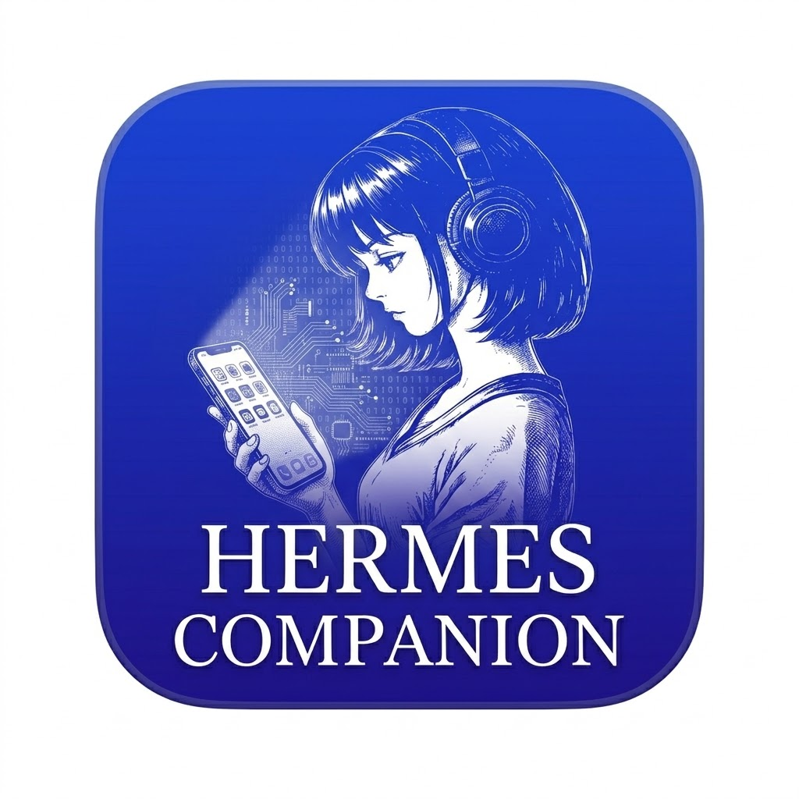
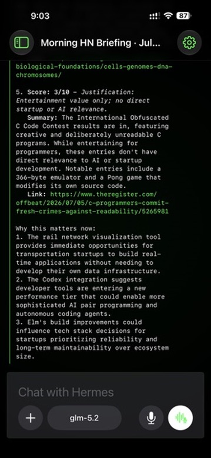
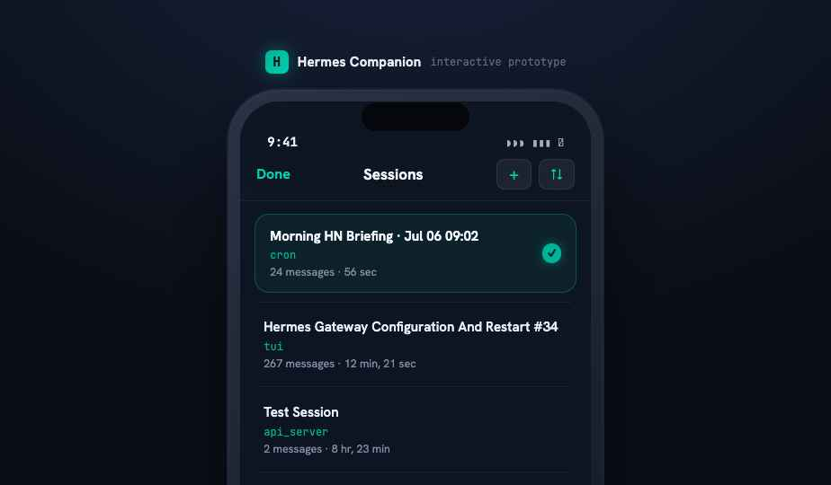
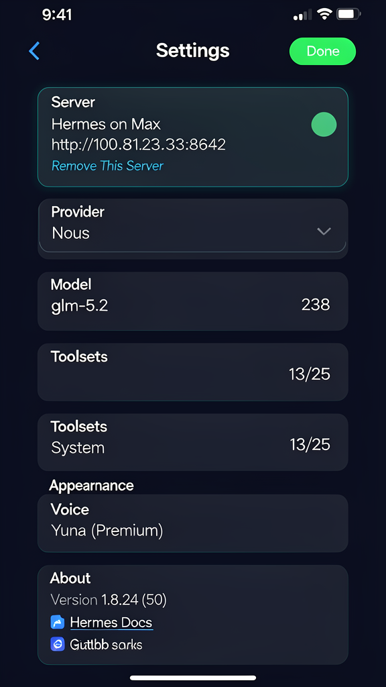
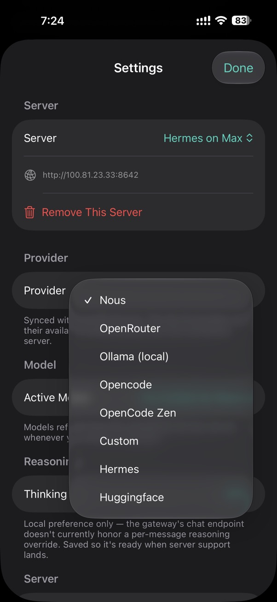
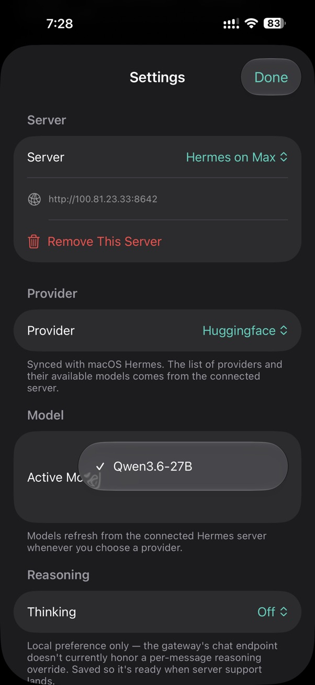
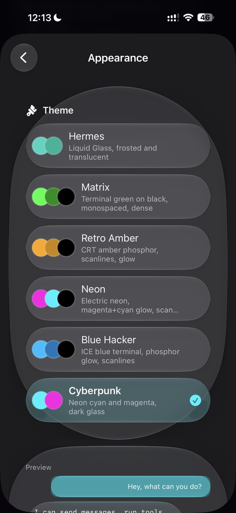

# Hermes Companion

[](https://www.apple.com/ios/)[](https://chibitek.com)[](https://github.com/chibitek/HermesCompanion/blob/main/LICENSE)[](https://github.com/NousResearch/hermes-agent)

**The native iOS client for [Hermes Agent](https://github.com/NousResearch/hermes-agent) by [Nous Research](https://nousresearch.com).** Chat with your AI agent, watch tool execution in real time, approve commands, and manage sessions from your phone. Voice conversation mode with on-device transcription. Six built-in themes including Liquid Glass, Matrix terminal, and Cyberpunk. Provider-agnostic — connect to any Hermes gateway and use any model.

Built by [Chibitek Labs](https://chibitek.com).

---

## Screenshots

### Chat
Real-time streaming chat with tool execution visibility, session management, and multimodal support.



### Sessions
Session history with message counts, durations, and types. Search, rename, fork, and switch between conversations.



### Settings
Configure your Hermes server connection, manage capabilities, voice, and appearance. Version display with links to docs and GitHub.



### Provider Selector
Switch between model providers (Nous, OpenRouter, Ollama, Huggingface, and more). Providers and models sync from your connected Hermes server.



### Model Selector
Pick from any model available on your Hermes gateway. Models refresh automatically when you change providers.



### Appearance and Themes
Six built-in themes including Liquid Glass (default), Matrix terminal, Retro Amber CRT, Neon, Blue Hacker, and Cyberpunk.



---

## Features

|     |     |
| --- | --- |
| **Real-time streaming chat** | Full SSE streaming with tool execution visibility, approval prompts, and multimodal support (photos and files). |
| **Voice conversation mode** | 2-way voice with on-device transcription via SFSpeechRecognizer, TTS playback, and a dedicated cyberpunk voice page with CRT effects and center-orb visualizer. |
| **Six themes** | Liquid Glass (default), Matrix terminal, Retro Amber CRT, Neon, Blue Hacker, and Cyberpunk. All terminal themes use monospaced fonts, scanlines, and phosphor glow. |
| **Session management** | Full session history with rename, fork, search, and auto-scroll to most recent message. Foreground sync for replies from other Hermes surfaces (macOS, Telegram, Discord). |
| **Provider-agnostic** | Connect to any Hermes gateway. Switch providers and models on the fly — Nous, OpenRouter, Ollama, Huggingface, OpenAI, and more. Models sync from your server. |
| **Auto-login** | Keychain credential storage with auto-connect on launch and background/foreground reconnection. |
| **Skills browser** | Search and browse all skills available on your Hermes server. |
| **Input bar** | Claude-style model picker pill, photo/file attachments, voice-to-text mic, waveform button for 2-way voice, and enter-key-sends. |

---

## Getting Started

### Prerequisites

- A running [Hermes Agent](https://github.com/NousResearch/hermes-agent) gateway (macOS, Linux, or serverless)
- iOS 26.0+ device or simulator
- Xcode 26+ with iOS 26 SDK

### Install

1. Clone the repo:
```bash
git clone https://github.com/chibitek/HermesCompanion.git
cd HermesCompanion
```

2. Generate the Xcode project:
```bash
xcodegen generate
```

3. Build and install on your device:
```bash
xcrun xcodebuild -project HermesCompanion.xcodeproj -scheme HermesCompanion \
  -configuration Debug -sdk iphoneos \
  DEVELOPMENT_TEAM=YOUR_TEAM_ID CODE_SIGN_IDENTITY="Apple Development" \
  ARCHS=arm64 ONLY_ACTIVE_ARCH=YES -allowProvisioningUpdates build
```

4. Launch the app and enter your Hermes gateway URL and API key.

📖 **[Hermes Agent documentation](https://hermes-agent.nousresearch.com/docs/)**

---

## Design

This project includes comprehensive design handoff documents:

- [DESIGN_HANDOFF.md](design/DESIGN_HANDOFF.md) — High-level design requirements and goals
- [TECHNICAL_SPEC_FOR_DESIGN.md](design/TECHNICAL_SPEC_FOR_DESIGN.md) — Detailed technical specifications for designers
- [HANDOFF_TO_ENGINEERING.md](design/HANDOFF_TO_ENGINEERING.md) — Engineering implementation guide

### Design Tokens

| Token | Value |
| --- | --- |
| Brand Teal | `#00B398` |
| Brand Teal Bright | `#00D4B3` |
| Brand Amber | `#F2A900` |
| Brand Danger | `#CF4520` |
| Background Base | `#0A0E16` |
| Background Surface | `#162032` |
| Text Primary | `#F2F6FC` |
| Matrix Green | `#00FF41` |

Typography: Hanken Grotesk (SF Pro fallback), JetBrains Mono (SF Mono fallback).

---

## Technical

- iOS 26.0+ target
- SwiftUI with Liquid Glass APIs
- Provider-agnostic (connects to any Hermes gateway)
- Keychain credential storage
- Background/foreground reconnection with Tailscale awareness
- Audio session interruption handling
- Screen stays awake during voice conversations
- Accessibility labels and reduce-motion support

---

## Community

- [Chibitek](https://chibitek.com)
- [Hermes Agent](https://github.com/NousResearch/hermes-agent)
- [Nous Research](https://nousresearch.com)
- [Hermes Discord](https://discord.gg/NousResearch)

---

## License

MIT — see [LICENSE](LICENSE).

Built by [Chibitek Labs](https://chibitek.com). Powered by [Hermes Agent](https://github.com/NousResearch/hermes-agent) by [Nous Research](https://nousresearch.com).
