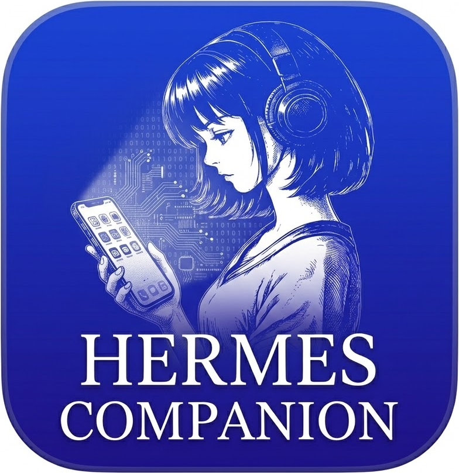

<div align="center">

# Hermes Companion

### The iOS front-end for [Hermes Agent](https://github.com/NousResearch/hermes-agent)

[](https://www.apple.com/ios/)
[](https://chibitek.com)
[](LICENSE)
[](https://github.com/NousResearch/hermes-agent)

**Chat. Voice. Camera. Controls. Tools. Approvals. Sessions. Themes.**

Your Hermes agent, in your pocket. Stream responses in real time. Talk out loud with Matrix-style voice mode. Approve tool executions. Switch models on the fly. All from your iPhone.

**Self-hosted. Your agent, your machine, your rules.** Run a Hermes Agent gateway on your Mac, Linux machine, or server. Companion connects to the address you configure. Use HTTPS or a configured private network such as Tailscale. Your gateway can use local models or external providers; its configuration determines where content is processed.

**Multiple servers. One app.** Connect to as many Hermes gateways as you want — your personal agent at home, your work agent at the office, a shared team server, a dedicated coding agent on a GPU box. Switch between them in Settings with a single tap. Each server keeps its own sessions, models, skills, and preferences.

Built by [Chibitek Labs](https://chibitek.com) on the [Hermes Agent](https://github.com/NousResearch/hermes-agent) platform by [Nous Research](https://nousresearch.com).

</div>

---

## Current build: 1.8.81 (178)

Build 176 includes the typed-chat audio fix and preserves spaces, paragraphs,
code indentation, JSON, and literal markup in live replies. The composer shows
a guidance arrow while busy and an up arrow while idle; guidance is queued after
the current reply. The trailing cursor indicates an active response.

Build 177 adds conversation-owned queued follow-ups, explicit draft recovery,
and structured stream-message decoding with field-specific errors. Build 178
also requires confirmed remote deletion before clearing a conversation or its
queued drafts and includes specific in-app update notes. Device inventory confirms
build 178 is installed, and launching it succeeded. Build 178 is Testing in the internal TestFlight group.

Builds 176, 177 and 178 are Testing in the internal group. The existing tester remains
Invited after a September 14 resend and reports the app absent from the active
TestFlight list. Acceptance and installation through TestFlight remain unverified.

Build 178 replaced the withdrawn build 176 App Store submission. Apple confirmed
its submission on September 14, and it is
Waiting for Review with manual release selected. Reviewer gateway access and
screenshot refresh/verification remain follow-up work.

The running verified gateway is Hermes 0.21.2 with all five compatibility patches
and Companion bridge 0.1.10. Authenticated native and bridge capability requests
succeed, and installed bridge files match this source. Installing the iOS app does
not update another user's gateway: follow [bridge installation](GatewayPlugin/README.md)
and [gateway compatibility instructions](GatewayPatches/README.md) for that server.

The ordinary suite passed 142 tests; a separate repeated live-gateway suite
passed all four integration tests. Physical audio transitions and intermittent
model latency remain under investigation. These results do not establish full
Hermes feature parity. See [release readiness](docs/RELEASE_READINESS.md) and
[App Store preparation](APP_STORE_SUBMISSION.md).

## Historical development notes

The snapshots below describe earlier builds. Their deployment and verification
status is superseded by the current release record above.

### Development desktop transcript repair (1.8.72)

Build 169 keeps assistant commentary that accompanies tool calls and shows the
recorded tool names inline. It respects server-hidden rows and preserves JSON
answers. Combined with full history pagination, this restores content missing
from long desktop conversations in older phone builds. Device installation and
live verification remain pending.

### Development run progress (1.8.71)

Build 168 displays lifecycle messages from prepared gateway patch 0004, including
waiting for another Hermes process to finish a shared conversation. These
messages work through both live events and status reconnection. Interrupted runs
remain distinct from completed runs. Deployment and live verification remain
pending; see [verification evidence](docs/SYNC_REPAIR_VERIFICATION.md).

### Development multi-client run streaming (1.8.69)

Build 166 supports run event replay and independent simultaneous viewers when
the server advertises them. It reconnects from the last applied event sequence,
ignores duplicates, and labels a replay gap as partial output while recovering
from run status. The prepared gateway patch prevents one viewer from consuming
another's events and bounds retained history. This patch still awaits deployment;
older gateways continue using the status-recovery behavior below.

### Development run controls (1.8.68)

Build 165 adds **Run Controls** in chat and Platform Hub. Start a durable text run
in the selected conversation, inspect live output and server status, respond to
an exact approval request, send guidance, or request a server-side stop. The app
remembers the latest run ID for each connection and restores status when reopened.
Admission requires advertised durable idempotency; lost-response retries keep the
same input and key across app restart, within the gateway retention window.
Pending messages use a protected local recovery file. Existing or restored runs
use status polling because the
current Hermes event queue cannot replay or broadcast events to multiple clients.
Gateway deployment and phone verification remain pending.

### Development project management (1.8.67)

Build 164 and bridge 0.1.9 add saved-project creation/editing, folder links and
labels, primary folders, archive/restore, active-project selection, and project
record deletion. Open **Projects > Manage Projects**, then choose the owning
profile. Native validation details remain visible. These changes are verified
locally and await gateway deployment and phone installation.

### Development Kanban editing (1.8.66)

Build 163 and bridge 0.1.8 add task creation, title/description/assignee/priority
editing, native workflow transitions, and comments. Writes are scoped to the
selected board and use Hermes's own handlers. Creation retries reuse one key;
updates send only changed fields. Server validation errors remain visible and
unsent text is retained. These changes are locally verified and await deployment.

### Development sync repair (1.8.65)

Build 162 adds visible gateway/chat response status, foreground conversation
sync, correct SSE frame delivery, full history pagination, model selection on
new sessions, and operation-specific errors. Bridge 0.1.7 adds live notification
of persisted workspace changes. These changes are not installed on the phone or
running gateway yet. The current gateway has two verified server regressions
that block skills and named custom-provider turns. See the
[repair verification and remaining parity work](docs/SYNC_REPAIR_VERIFICATION.md).

### Prior Release Status (1.8.63)

Build 158 adds profile-owned project history, full Kanban task results, comments,
runs, and navigation through task dependencies and children. It also adds
Kanban attachment downloads and Quick Look previews. Companion fixes cover stale
session/model refreshes, delayed session creation, stream ownership after
session changes, CarPlay disconnect cleanup, old voice-answer replay, unchanged
job schedules during edits, audio isolation for text-only use, and a local-only
voice surface.

The development Mac was previously verified with bridge 0.1.6. The new
[bridge 0.1.9](GatewayPlugin/README.md) still requires gateway deployment.
See [release verification and remaining gaps](docs/RELEASE_READINESS.md) for
what remains unverified.

### Server Workspace Browsing (1.8.62)

The History sidebar includes **Projects**, **Bots**, and **Kanban** tabs. These
read Hermes's actual project trees, Bot profiles with configured models, and
Kanban boards and tasks. Empty project folders and profile ownership are
preserved. Open views refresh every 30 seconds and reset on a server change.
Builds 156 and later add paginated canonical Bot conversation history, including
Hermes's display projection for compacted messages. Build 167 adds **Chat with
Bot**, which verifies the canonical conversation through a matching saved profile
connection before opening durable Run Controls. Named profiles require their own
saved `/p/<profile>` connection and a gateway that serves that route. A missing
canonical conversation must first be initialized in Hermes.

This requires the [Companion workspace bridge](GatewayPlugin/README.md) on each
connected server. The bridge uses Hermes's existing domain handlers and root
gateway authorization; it does not add another agent or credential store.
Servers without it report that the workspace API is unavailable.

Full desktop parity remains incomplete: live cross-profile Bot chat requires
gateway route enablement and end-to-end verification, and advanced Kanban
operations remain unfinished. Basic task editing is
implemented in build 163 and saved-project management in build 164. Scheduled job
controls remain available in Platform Hub through Hermes's existing jobs API.

### Voice Conversation

The standout feature. Tap the waveform icon and your phone becomes a full-screen voice conversation terminal.

- **Matrix digital rain** background that responds to conversation state (fast rain while listening, slow glow while thinking, medium while speaking)
- **CRT scanlines and phosphor glow** for that terminal aesthetic
- **Center-orb audio visualizer** with real-time glow pulse
- **Glitch text animations** on the VOICE_MODE indicator
- **4 voice presets**: Matrix (green), Retro Amber, Neon, Blue Hacker
- **On-device transcription** via SFSpeechRecognizer — your speech never leaves the phone until you send it
- **TTS playback** with configurable voice, speed, and pitch
- Screen stays awake during conversations


---

## Interface

### Chat

Real-time streaming chat with full tool execution visibility. Watch your agent think, call tools, and stream responses. Approve commands before they run. Send photos and files. All in real time.


### Multimodal Attachments

Send photos and files directly in chat. Tap the paperclip to attach from Camera, Photo Library, or Files. Photos from the camera or library are automatically converted to JPEG for LLM vision API compatibility.


### Hermes Talk

The standout feature. Tap the waveform icon and your phone becomes a full-screen voice conversation terminal with Matrix digital rain, CRT effects, and a center-orb visualizer.


### Settings

Server connection, provider and model selection, capabilities toggles, skills browser, toolsets, voice configuration, appearance, and version info. All in clean glass-card sections.


### Model Selector

Switch between any model your Hermes gateway can reach. The full provider catalog syncs from your server — every configured source (OpenRouter, xAI, OpenAI, Kimi, Ollama, Hugging Face, NVIDIA, and more), grouped by provider with live model counts. Star multiple favorites to pin them to the top, tap a model to pick between the sources that serve it. The same catalog powers the Settings drill-down: pick a Source, then browse every model that source reported.


### Themes

Six built-in themes in a visual grid picker. Each one transforms the entire app — chat bubbles, input bar, settings, and voice page.

| Theme | Style |
| --- | --- |
| **Hermes** | Liquid Glass. Frosted, translucent, default. |
| **Matrix** | Terminal green on black. Monospace. Scanlines. CRT glow. |
| **Retro Amber** | CRT amber phosphor. Scanlines. Glow. |
| **Neon** | Electric magenta + cyan. Scanlines. |
| **Blue Hacker** | ICE blue terminal. Phosphor glow. |
| **Cyberpunk** | Dark glass with neon cyan and magenta accents. |


---

## Features

| | |
| --- | --- |
| **Real-time streaming chat** | SSE chat with tool visibility and supported image/text attachments. Durable Run Controls add native approval decisions and steering. |
| **Camera attachments** | Take photos directly from within the app and send them to your agent for analysis. No need to switch to the Camera app and back. |
| **Hermes Talk voice mode** | 2-way voice conversation with on-device transcription, TTS playback, Matrix rain visualizer, CRT effects, and 4 cyberpunk voice presets. |
| **Hey Hermes wake phrase** | Hands-free activation. Say "Hey Hermes" to start a voice conversation without touching the screen. Toggle from in-app settings or Control Center. |
| **Control Center toggle** | Toggle Hey Hermes voice activation directly from iOS Control Center. The toggle stays in sync with the in-app setting via App Group shared storage. |
| **Six themes** | Liquid Glass, Matrix terminal, Retro Amber CRT, Neon, Blue Hacker, and Cyberpunk. Every theme transforms the entire app. |
| **Session management** | Full history with rename, fork, search. Auto-scroll to most recent message. Foreground sync for cross-platform replies. |
| **Provider-agnostic** | Connect to any Hermes gateway. The complete provider catalog syncs from the server — every configured source and all its models, selectable on the fly. |
| **Multi-favorite model picker** | Star multiple models to pin them to the top of the picker. Grouped by source (Ollama, Nous, Anthropic, etc.). Tap a star to favorite, tap again to remove. |
| **Native run controls** | Run Controls shows exact approval requests, advertised decision scopes, steering, stop state, and durable status recovery. |
| **Skills browser** | Search and browse all skills available on your Hermes server. 238+ skills at your fingertips. |
| **Skills command bar** | Type `/` in the input bar to search and invoke skills by name. Skill suggestions filter as you type. |
| **Multiple servers** | Connect to unlimited Hermes gateways. Personal, work, team, or dedicated GPU agents — switch with one tap. Each server keeps its own sessions, models, skills, and preferences. |
| **Project linking** | Link sessions to projects for organized context. Assign projects from the session picker. |
| **Auto-login** | Keychain credential storage with auto-connect on launch, per-server active-chat restoration, and background/foreground reconnection with Tailscale awareness. A 60-second liveness check runs while the app is open and silently reconnects if the socket drops (gateway restart, network switch, tunnel rekey). |
| **Splash screen** | Logo fade-in on launch with smooth transition to chat or login. |
| **What's New alerts** | After an app version changes, a one-time popup explains the release highlights. |
| **Input bar** | Claude-style model picker pill, camera/photo/file attachments, voice-to-text mic, waveform button for Hermes Talk, skills command bar, and configurable enter-key-sends. |
| **Local TTS** | Voice replies use Apple's on-device speech synthesis with enhanced/premium voice selection, speed, and pitch controls. |
| **CarPlay voice mode** | Voice-first CarPlay support. Toggle Hermes Talk from your car's dashboard. |

---

## How It Works

```
┌─────────────────┐                        ┌─────────────────────────┐
│  iPhone         │                        │  Your Machines           │
│                 │   Tailscale WireGuard  │                          │
│  Hermes         │◄──────encrypted────────►│  Server A: Personal      │
│  Companion      │      tunnel             │  - Hermes Agent Gateway  │
│                 │                        │  - LLM, Tools, Memory    │
│  - Chat UI      │   http://100.x.x.x:8642│                          │
│  - Voice mode   │◄──────────────────────►│  Server B: Work          │
│  - Tool approve │   http://100.y.y.y:8642│  - Hermes Agent Gateway  │
│  - Sessions     │◄──────────────────────►│  - Different models      │
│  - 6 themes     │                        │  - Team shared sessions  │
│  - Multi-server │   http://100.z.z.z:8642│                          │
│  switcher       │◄──────────────────────►│  Server C: GPU Box       │
└─────────────────┘                        │  - Hermes Agent Gateway  │
                                           │  - Coding-focused agent  │
                                           └─────────────────────────┘
```

**You control the gateway.** The iPhone app streams responses, displays tool events, and sends your messages. Hermes handles model calls, tools, memory, and scheduled jobs. Your gateway's model and tool configuration determines whether content reaches external providers. Connect using HTTPS or your configured private network, and switch saved servers in Settings.

---

## Getting Started

### Prerequisites

- A running [Hermes Agent](https://github.com/NousResearch/hermes-agent) gateway — on your own machine, a VPS, or serverless infrastructure. This is self-hosted: you run the agent on your own box.
- iOS 26.0+ device or simulator
- Xcode 26+ with iOS 26 SDK
- [Tailscale](https://tailscale.com) installed on both your iPhone and the machine running your Hermes gateway
- An API key from any LLM provider (Nous Portal, OpenRouter, OpenAI, Anthropic, or your own local model via Ollama)

### Why Tailscale?

Your Hermes gateway runs on a private network — your Mac, a home server, or a VPS. It has no public IP and no open ports. Tailscale creates an encrypted WireGuard tunnel between your iPhone and your gateway so the app can reach it securely from anywhere.

No port forwarding. No DDNS. No exposing your machine to the internet. Tailscale handles it.

1. Install [Tailscale](https://apps.apple.com/app/tailscale/id1470492403) from the App Store on your iPhone.
2. Install Tailscale on the machine running your Hermes gateway (`curl -fsSL https://tailscale.com/install.sh | sh` on Linux/macOS).
3. Sign in to both with the same account.
4. Your gateway is now reachable at your machine's Tailscale IP (e.g., `http://100.x.x.x:8642`).

The app handles Tailscale reconnection automatically — if the tunnel drops during a quick app switch, it retries in the background without kicking you to the login screen.

### Install

1. Clone the repo:
```bash
git clone https://github.com/chibitek/HermesCompanion.git
cd HermesCompanion
```

2. Generate the Xcode project:
```bash
xcodegen generate
```

3. Build and install on your device:
```bash
xcrun xcodebuild -project HermesCompanion.xcodeproj -scheme HermesCompanion \
  -configuration Debug -sdk iphoneos \
  DEVELOPMENT_TEAM=YOUR_TEAM_ID CODE_SIGN_IDENTITY="Apple Development" \
  ARCHS=arm64 ONLY_ACTIVE_ARCH=YES -allowProvisioningUpdates build
```

4. Make sure Tailscale is connected on both devices.

5. Launch the app and enter your Hermes gateway URL (your machine's Tailscale IP and port) and API key.

6. Start chatting. Tap the waveform icon for Hermes Talk.

📖 **[Hermes Agent documentation](https://hermes-agent.nousresearch.com/docs/)**

---

## Privacy and Security

Hermes Companion is self-hosted and privacy-first:

- **Direct gateway connection.** Your gateway may use local models or external providers. HTTPS or a configured VPN protects the connection; Tailscale is optional.
- **Credentials in Keychain.** Your gateway URL and API key are stored in the iOS Keychain — not in plaintext, not in UserDefaults, not synced to iCloud.
- **On-device voice transcription.** Speech-to-text runs locally via Apple's SFSpeechRecognizer. Your voice audio never leaves the phone until you choose to send the transcription.
- **No analytics.** No telemetry, no tracking, no crash reporting to third parties. The app does not phone home.
- **Local diagnostics.** On-device logs can contain connection details and conversation excerpts. Review them before sharing. See the [privacy policy](PRIVACY.md).
- **Server-side approval policy.** Hermes controls when tools require approval. Run Controls displays the exact pending request and only the choices advertised by Hermes. Broader session/permanent scopes require an additional in-app confirmation.
- **Open source.** The entire app is MIT-licensed and auditable. No hidden binaries, no proprietary SDKs.

---

## FAQ

**Do I need a Hermes Agent gateway to use this app?**

Yes. Hermes Companion is a client — it connects to a [Hermes Agent](https://github.com/NousResearch/hermes-agent) gateway that you run on your own machine. The gateway handles LLM calls, tool execution, memory, and session management.

**Can I use this without Tailscale?**

Yes. A reachable, authenticated HTTPS gateway or a trusted local connection can
work without Tailscale. Tailscale is one option for private remote access. Merely
entering an HTTP address does not establish an encrypted tunnel.

**Which models are supported?**

Any model your Hermes gateway supports. That includes Nous Portal (300+ models), OpenRouter, OpenAI, Anthropic, Google, local models via Ollama, and any OpenAI-compatible endpoint. Switch models mid-conversation with a single tap.

**Does voice mode send my audio to a server?**

No. Voice transcription runs on-device via Apple's SFSpeechRecognizer. The transcribed text is sent to your Hermes gateway only after you speak it — the same as if you had typed it.

**Can I use multiple Hermes servers?**

Yes. This is a core feature, not an afterthought. Connect to as many Hermes gateways as you want — a personal agent at home, a work agent at the office, a shared team server, or a dedicated coding agent on a GPU box. Each server is saved independently with its own URL, API key, label, sessions, models, skills, and preferences. Switch between them from Settings with a single tap. No re-login, no reconfiguration.

**Is this an official Nous Research product?**

No. Hermes Companion is built by [Chibitek Labs](https://chibitek.com) as a third-party iOS client for the Hermes Agent platform. Hermes Agent is built by [Nous Research](https://nousresearch.com).

**What's the difference between the app and the terminal?**

The app is a front-end for an existing Hermes gateway, not a separate agent.
Supported views read the connected server's data, but it does not yet expose
every terminal or desktop feature. Cross-profile messaging requires a verified
profile-specific chat transport; advanced Kanban operations remain unfinished.
Basic Kanban editing is available in development build 163, and saved-project
management in build 164.
Workspace browsing also requires the optional Companion bridge. Availability
depends on the connected Hermes version and configuration.

---

## Design

This project includes comprehensive design handoff documents:

- [DESIGN_HANDOFF.md](design/DESIGN_HANDOFF.md) — High-level design requirements and goals
- [TECHNICAL_SPEC_FOR_DESIGN.md](design/TECHNICAL_SPEC_FOR_DESIGN.md) — Detailed technical specifications for designers
- [HANDOFF_TO_ENGINEERING.md](design/HANDOFF_TO_ENGINEERING.md) — Engineering implementation guide

### Design Tokens

| Token | Value |
| --- | --- |
| Brand Teal | `#00B398` |
| Brand Teal Bright | `#00D4B3` |
| Brand Amber | `#F2A900` |
| Brand Danger | `#CF4520` |
| Background Base | `#0A0E16` |
| Background Surface | `#162032` |
| Text Primary | `#F2F6FC` |
| Matrix Green | `#00FF41` |

Typography: Hanken Grotesk (SF Pro fallback), JetBrains Mono (SF Mono fallback).

---

## Technical

- iOS 26.0+ target
- SwiftUI with Liquid Glass APIs
- Provider-agnostic (connects to any Hermes gateway)
- Keychain credential storage
- Background/foreground reconnection with Tailscale awareness
- Audio session interruption handling
- Screen stays awake during voice conversations
- Accessibility labels and reduce-motion support
- Logo splash screen on launch

---

## Contributing

Hermes Companion is open source and contributions are welcome.

1. Fork the repo
2. Create a feature branch (`git checkout -b feature/my-feature`)
3. Commit your changes (`git commit -m "Add my feature"`)
4. Push to your fork (`git push origin feature/my-feature`)
5. Open a Pull Request

For design contributions, see the [design handoff documents](#design) for the design system, tokens, and specs.

---

## Roadmap

- [x] App Store submission (pending review)
- [ ] Push notifications for tool approval requests
- [x] Control Center widget for voice activation toggle
- [x] CarPlay voice mode
- [ ] Siri Shortcuts integration
- [ ] Apple Watch companion app
- [ ] iPad layout with split-view sessions and chat
- [ ] Offline message queue for unreliable connections
- [ ] E2EE session notes export
- [ ] Custom voice training for TTS
- [ ] In-app subscriptions

---

## Community

- [Chibitek](https://chibitek.com) — Built by Chibitek Labs
- [Hermes Agent](https://github.com/NousResearch/hermes-agent) — The agent platform
- [Nous Research](https://nousresearch.com) — AI research lab
- [Hermes Discord](https://discord.gg/NousResearch) — Community

---

## License

MIT — see [LICENSE](LICENSE).

<div align="center">

Built by [Chibitek Labs](https://chibitek.com). Powered by [Hermes Agent](https://github.com/NousResearch/hermes-agent) by [Nous Research](https://nousresearch.com).

</div>
